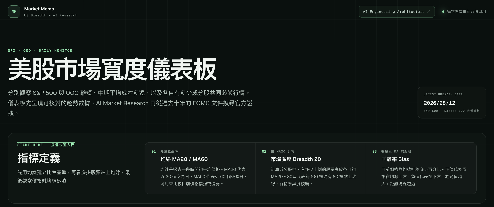
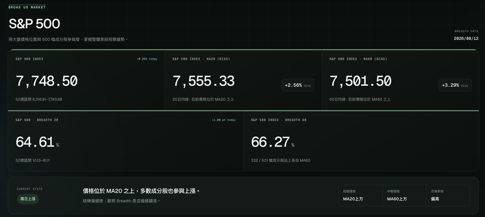
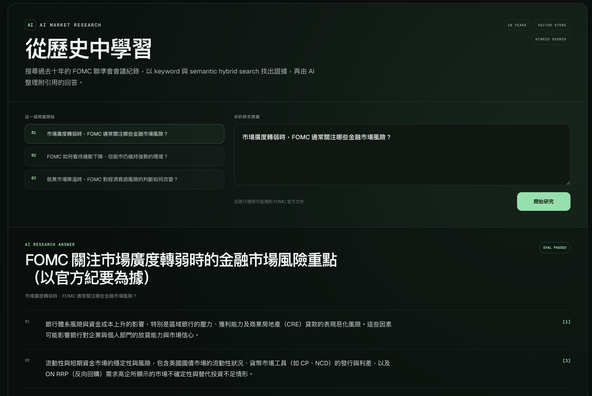

# AI Market Research

[Live product](https://us-market-breadth.jl5908766.chatgpt.site/) · [AI engineering architecture](https://us-market-breadth.jl5908766.chatgpt.site/architecture)

An AI-powered US market breadth dashboard and FOMC research assistant. It combines verifiable SPX and QQQ market indicators with a grounded RAG workflow over ten years of official Federal Reserve minutes.

## Product demo

### Product overview

The dashboard starts with plain-language definitions of MA20, MA60, Breadth, and Bias so new users can understand the indicators before interpreting market conditions.

<p align="center">
  
</p>

### Market breadth indicators

S&P 500 and Nasdaq-100 sections combine index price, MA20/MA60 Bias, Breadth 20/60, and a concise market-state interpretation.

<p align="center">
  
</p>

### FOMC RAG research answer

Users can choose a suggested question or enter their own. The system retrieves official FOMC evidence and generates a Traditional Chinese answer with chunk-level citations. When a check fails, it returns an explicit refusal reason instead of a partially grounded answer.

<p align="center">
  
</p>

## How one research request works

```text
User question
    ↓
LLM query rewrite → semantic query + FOMC keywords
    ↓
Semantic search (cosine)  +  Keyword search (FTS5 / BM25)
    ↓
Reciprocal Rank Fusion → source diversity → top 6 evidence chunks
    ↓
Structured LLM answer with chunk-level citations
    ↓
Citation, temporal, retrieval, and safety evaluation
    ├── Pass → cited answer
    ├── Citation / retrieval failure → LangGraph corrective retry (maximum once)
    └── Safety failure or second failure → explicit refusal reason
```

Semantic and keyword search each retrieve up to 30 candidates. These are ranking pools, not LLM context: RRF merges them, limits each document to two chunks, and sends only the final six evidence chunks to generation.

## AI engineering highlights

| Capability | Implementation |
| --- | --- |
| LLM application | Query rewriting, structured outputs, grounded Traditional Chinese answers |
| RAG | LangChain Documents and section-aware RecursiveCharacterTextSplitter over ten years of official FOMC minutes |
| Hybrid retrieval | OpenAI embeddings + exact cosine similarity + FTS5/BM25 + RRF |
| Agent workflow | LangGraph StateGraph with conditional edges and one bounded corrective RAG retry |
| AI evaluation | Citation validity/support, temporal safety, retrieval availability, and trading-instruction checks |
| Guardrails | Fail-closed refusal with a user-visible reason, failed checks, and request ID |
| Observability | Persistent execution summaries with retrieval statistics and evaluation results |

## Knowledge and retrieval pipeline

1. Discover official FOMC minutes from a rolling ten-year window.
2. Parse document sections and clean paragraph content.
3. Apply LangChain section-aware recursive chunking at 500–700 tokens with 90-token overlap.
4. Generate 256-dimensional OpenAI embeddings.
5. Store documents, chunks, metadata, Float32 vectors, and FTS5 indexes in Cloudflare D1.
6. Run semantic and keyword retrieval independently, then fuse rankings with RRF.
7. Select up to six evidence chunks, with no more than two from one document.

At the current corpus size, embeddings are stored in D1 and searched with an application-level exact cosine scan. This is intentionally a simple POC boundary rather than a dedicated vector database.

## Evaluation and refusal strategy

An answer is shown only when every post-generation check passes:

- Semantic **or** keyword retrieval returned candidates.
- Every answer point cites a retrieved chunk ID.
- A second LLM verification confirms that each citation directly supports its claim.
- No document was published after the request date.
- The answer contains no trading or position-sizing instruction.

Citation or retrieval failures trigger one LangGraph corrective cycle: rewrite the query, retrieve again, regenerate, and reevaluate. Safety failures stop immediately. If the corrective result still fails, the UI shows the refusal category, failed check, and request ID instead of returning a partially grounded conclusion.

## Execution logs

Each request stores a compact summary containing its request ID, duration, status, model, retrieved chunk IDs, search statistics, LangGraph attempts and corrections, workflow steps, and evaluation results.

- Hosted requests: Cloudflare D1 table `market_brief_executions`
- Local previews: `.local-data/market-brief-executions.jsonl` (excluded from Git)

Logs do not store the API key, complete prompts, or full FOMC documents.

## Technology stack

- **LLM:** OpenAI Responses API, Structured Outputs, GPT-5 nano
- **RAG:** LangChain Documents, RecursiveCharacterTextSplitter, OpenAI Embeddings, RRF
- **Workflow:** LangGraph StateGraph, conditional edges, corrective RAG
- **Search:** exact cosine similarity, SQLite FTS5, BM25
- **Data:** Cloudflare D1, SQLite, Drizzle ORM
- **Application:** TypeScript, React, Next.js, Cloudflare Workers
- **Quality:** Node Test Runner, ESLint, AI evaluation, guardrails
- **Delivery:** GitHub Actions, OpenAI Sites

## Local development

Requires Node.js `>=22.13.0`.

```bash
cp .env.example .env.local
npm install
npm run dev
```

Set `OPENAI_API_KEY` in `.env.local`. The key stays server-side and is never sent to the browser.

## Validation

```bash
npm run lint
npm test
```

## Data sources

- TradingView: live/delayed market price cards and constituent data
- Barchart: S&P 500, Nasdaq-100, and breadth history
- Federal Reserve: official FOMC minutes

Market data may be delayed. This project is for research and does not provide investment advice.

## Deployment

GitHub Actions validates every push and pull request. Production publishing is a separate Sites release step using the same validated commit, keeping the public repository and live website traceable to one source revision.
